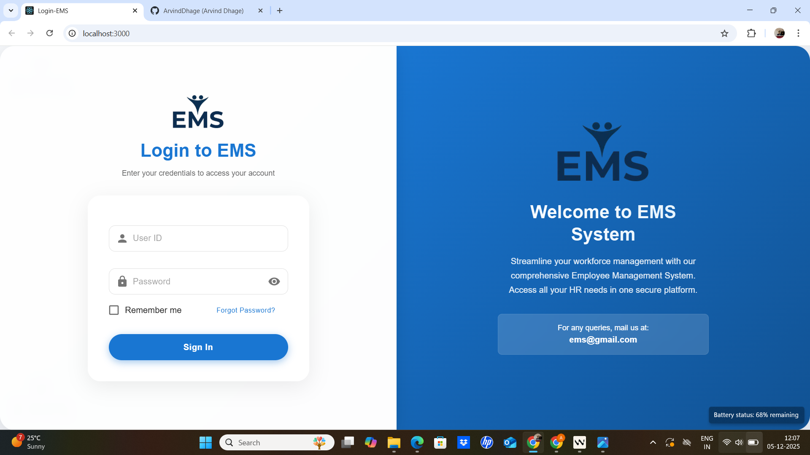

# Employee Management System
 🚀 Employee Management System (EMS)

The Employee Management System (EMS) is a modern, responsive, and secure web application designed to simplify and streamline organizational workforce management.
This system provides role-based access such as Admin, Manager, and Employee, ensuring smooth internal operations with a user-friendly interface.

🎯 Project Objective

EMS ka main purpose hai employees, teams, tasks, skills, and productivity ko efficiently manage karna.
System workflow ko digital banakar organizations ko real-time insights aur automation provide karta hai.

### Output

#### Login Page 

